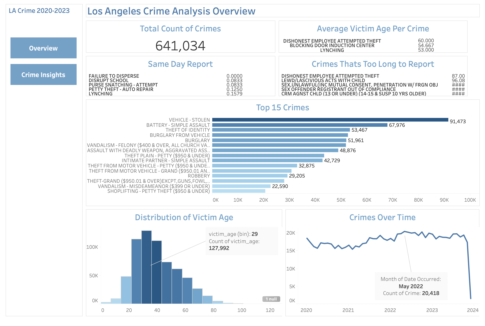

# LA-Crime-Data-Analysis-Project
In this project, I analyzed crime data from Los Angeles to showcase the skills I’ve learned as a data analyst using Python(Pandas, Matplotlib & Tableau).
# Project Background
This project utilizes a dataset containing recorded incidents of crime in the City of Los Angeles, dating back to 2020. The data is transcribed from original paper-based crime reports, which may introduce minor inaccuracies. To ensure privacy, exact addresses are anonymized and only shown to the nearest hundred block, and some entries with missing location data are recorded as (0°, 0°).

The goal of this project is to thoroughly analyze and synthesize the data to uncover critical insights related to crime patterns, frequency, and locations across Los Angeles. By identifying key trends and anomalies, the analysis aims to support better decision-making for public safety, community awareness, and resource allocation.

Insights and recommendations are provided on the following key areas:
* **Crime Trends Over Time:** An evaluation of crime over time.
* **Victim Demographics:** Analyzing the distribution of victim age.
* **Geographic Crime Patterns:** Analyzing the area with the highest number of crimes based on the date occurred.
* **Time-Related Patterns:** Analyzing the average time to report a crime.
  
The Python (Pandas) code used to inspect and clean the data for this analysis can be found [here](Understand_and_Prepare_data.ipynb).

The Python (Pandas, Matplotlib) code regarding various business questions can be found [here](Analysis_Regarding_Questions.ipynb).

The Tableau dashboard used to report and explore patterns by time and location can be found [here](https://public.tableau.com/views/CrimesOverTime/LACrimeOverview?:language=en-US&publish=yes&:sid=&:redirect=auth&:display_count=n&:origin=viz_share_link).

# Data Structure & Initial Checks
LA Crime database structure as seen below consists of one table with a total row count of 852,950 records. A description of each column is as follows:
- **division_number:** unique identifier of division.                              
- **date_reported:** The date that was the crime reported.                         
- **date_occurred:** The date that was crime occurred.                             
- **area:** Area number                                                            
- **area_name:** Area location
- **reporting_district:** Reporting district number
- **part:** 
- **crime_code:** The unique identifier for each crime
- **crime_description:** The title or name of a crime.
- **victim_age:** The age of victims of the crime.
- **victim_sex:** The gender of the victim.
- **victim_descent**
- **premise_code:**
- **premise_description:**
- **status:**
- **status_description:**
- **crime_code_1:**
- **location:**
- **latitude:**
- **longitude:**
- **year:**
- **month:**
- **date_occurred_no_time:**
- **Time To Report:**
# Executive Summary
**Overview of Findings**

The Overall crime incidents records a total of 641,034 from 2020-2023 dataset. Most common crime types is vehicle-related crimes. **Vehicle – Stolen** is the most frequent crime with 91,473 incidents. Other high-volume crimes include Simple Assault (67,976), Identity Theft (53,467), and Burglary-related offenses. Certain crime types show higher average victim ages, such as: **Dishonest Employee Attempted Theft** (average age ~60), **Blocking Door / Induction Center and Lynching** (average age above 50). Some crimes are reported almost immediately, including: **Failure to Disperse**, **Disrupt School** and **Purse Snatching – Attempt**. Crimes that take the longest time to report include: **Dishonest Employee Attempted Theft**, **Lewd or Lascivious Acts with a Child** and **Sex Offender Registry Violations**.

From January 2020 to October 2023, crime incidents showed fluctuating trends with periods of decline and significant peaks. Crimes initially decreased from 18,496 in January 2020 to 15,683 in April 2020, followed by a gradual rise through 2021. Peaks occurred in October 2021 (19,305), March 2022 (19,687), and May 2022 (20,418), the latter being the highest in the period. Afterward, crime levels generally declined to 19,394 by October 2023, though overall incidents remained higher than early 2020 levels. Despite short-term decreases, the overall trend indicates sustained crime activity over the period.

Most victims are adults between 22 and 42 years old, with the highest concentration in the 29–35 age group with a count  of (127,992). Incidents are less frequent among young children and older adults, indicating that people in their late 20s to early 40s are the most likely to be victims.

The overall trend indicates sustained crime activity over the period. Crime shows cyclical fluctuations with notable peaks and troughs, while reporting timelines and victim demographics vary widely by crime type. These patterns can help stakeholders focus on preventive strategies, faster reporting for sensitive cases, and targeted public safety interventions.

# Insights Deep Dive
**Category 1:**

- **Main insight 1.** 
[Visualization specific to category 1]

# Recommendations:
Based on the insights and findings above, the recommendations to consider the following: 

# Assumptions & Caveats
Throughout the analysis, multiple assumptions were made to manage challenges with the data. These assumptions and caveats are noted below:
*
*
*
